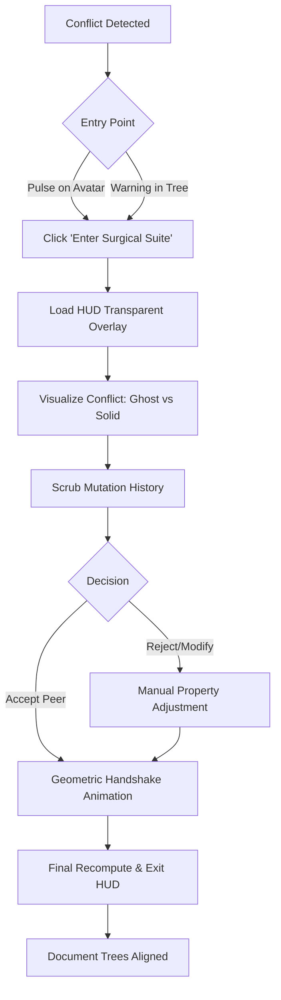
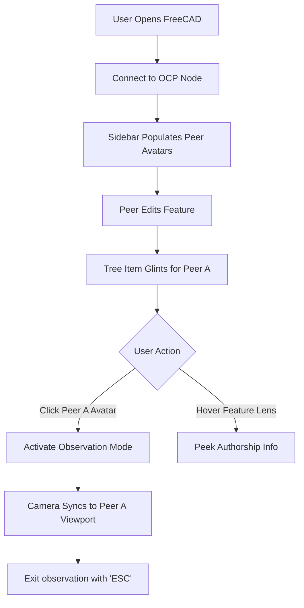
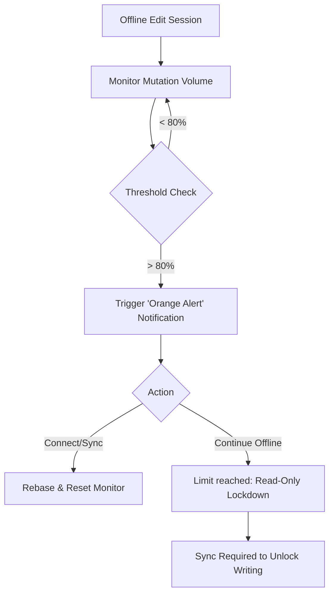

# UX Design Specification CollaborativeFC

**Author:** Aratz
**Date:** 2025-12-18

---

## Executive Summary

### Project Vision
CollaborativeFC transforms FreeCAD from a discrete, file-based CAD island into a real-time, peer-to-peer engineering ecosystem. By leveraging the **Distributed Parametric Protocol (DPP)**, it shifts the UX focus from "managing documents" to "designing concurrently," introducing the **Surgical Suite** as a native collaborative environment for resolving complex geometric and logical conflicts without leaving the 3D viewport.

### Target Users
- **Sarah (The Midnight Integrator)**: High-performing engineers working across time zones who need immediate "Merge Confidence." She values speed, visual clarity in conflicts (3D Ghosting), and reliable state-auditing to prevent design regressions.
- **Alex (The Trusted Maintainer)**: Open-source project leads who manage massive community contributions. He requires high-efficiency visual diffing and automated validation workflows to scale project oversight without manual overhead.
- **Leo (The Traveling Engineer)**: Professionals who balance offline work with high-density collaboration. He relies on proactive "Mutation Drift" alerts to manage his integration risk while disconnected from the P2P swarm.

### Key Design Challenges
- **Semantic Conflict Visualization**: Clearly representing parametric overlaps (e.g., two people changing the same base radius) that may not result in immediate 3D recompute errors but violate design intent.
- **Seamless Context Awareness**: Ensuring the user knows who is working on which feature in the Tree without creating visual clutter or distraction.
- **Topological Integrity UI**: Communicating abstract naming-breaks or lost face-references in a way that is intuitive to a non-programmer engineer.

### Design Opportunities
- **Collaborative Pulse**: A live presence system in the FreeCAD sidebar that highlights active peers and locks "owned" features in real-time.
- **Shadow-Validation Overlays**: Giving the user a "crystal ball" view of how a peer's changes would look in their current context before they ever hit the merge button.

---

## Core User Experience

### Defining Experience
The heart of the CollaborativeFC experience is **"Ambient Synergy."** Users don't just "share files"; they share a living workspace where the proximity of others is felt through subtle visual cues. The primary interaction is the **Social Recompute Loop**, where local edits and peer mutations blend seamlessly into the master geometry.

### Platform Strategy
- **Native Windows Add-on**: Built to feel like a first-party FreeCAD module.
- **Sidecar Connectivity**: Reliable P2P networking that runs in the background, surfacing its status only when critical (e.g., disconnection or drift alerts).

### Effortless Interactions
- **Presence Tracking**: Users can see exactly which feature a peer is viewing or editing via a **Color-Coded Glow** in the Feature Tree and a **Spatial Ghosting** of their 3D selection.
- **Automatic Ghosting**: When a peer edits a feature, their geometry appears as a low-alpha ghost over the user's current model, providing immediate context for the change.
- **Zero-Config Sync**: Once a project is shared, mutations propagate automatically with zero manual "Push/Pull" actions required for standard edits.

### Critical Success Moments
- **The "Tree Glow" Discovery**: A user sees a peer's avatar move down the Feature Tree, realizing they are no longer working alone in an "offline silo."
- **The "Ghost Alignment"**: A user sees a peer's suggested edit perfectly ghosted over their own work, allowing for a split-second design decision without a single chat message.

### Experience Principles
- **"Presence Without Intrusion"**: Show who is doing what, but never block the user's view or input unless a direct conflict occurs.
- **"3D-First Resolution"**: Conflict resolution happens where the design is—in the 3D viewport, not in hidden menus.
- **"Mechanical Familiarity"**: Interface elements should feel like "Engineering Tools" (e.g., overlays look like blueprints or x-rays), reinforcing the professional nature of the work.

---

## Desired Emotional Response

### Primary Emotional Goals
- **Connected**: Engineering is no longer a solo endeavor; the UI reinforces that you are part of a synchronized swarm.
- **Excitement & Scale**: The feeling of "powering up." Seeing multiple peers active in the tree feels like a force multiplier.
- **Confidence**: "Surgical Certainty." High-fidelity data (Ghosting/Audit) replaces anxiety with professional control.

### Emotional Journey Mapping
- **Discovery**: "Whoa, I can see everyone!" (Excitement).
- **Core Activity**: "We're moving fast, and I can see the impact." (Connected/Flow).
- **Conflict Moment**: "Wait, a clash... but I see the fix clearly." (Confusion → Immediate Confidence).
- **Completion**: "Done in minutes what used to take hours of emails." (Accomplishment/Trust).

### Micro-Emotions
- **Trust**: Fostered by "Shadow Peer" logic—validated geometry before interaction.
- **Belonging**: Fostered by "Tree Glow"—seeing your work and peers' work as one cohesive entity.

### Design Implications
- **Vibrant Presence**: Use warm, distinct colors for peer "glows" in the tree to foster connection.
- **High-Fidelity Ghosting**: Crisp, "pro-grade" (blueprint style) overlays to build 3D data confidence.
- **Positive Feedback**: Subtle "Sync Successful" micro-animations to reinforce system calibration.

### Emotional Design Principles
- **"Connection through Transparency"**: If a peer is looking at a feature, show it. Knowledge kills anxiety.
- **"The Calm Center"**: The Surgical Suite feels like a high-tech lab, not an "Emergency Room."
- **"Pride in the Protocol"**: Interactions remind the user that data is local, sovereign, and perfectly synced.

---

## UX Pattern Analysis & Inspiration

### Inspiring Products Analysis
- **Figma**: The gold standard for "Multi-player Presence." We draw from its seamless avatar system and **Observation Mode**, where clicking a peer's avatar instantly aligns your 3D viewport with their current focus.
- **VS Code (GitLens)**: Inspires our "Authorship Attribution." The subtle inline annotations (Lens) that show who last modified a line of code will be adapted for individual CAD features in the Tree.
- **Onshape**: Provides the baseline for professional cloud CAD expectations, but we aim to exceed its "Serial Workflow" by introducing more proactive, social conflict resolution.

### Transferable UX Patterns
- **Feature Tree Timeline (The "Mechanical Git")**: Every item in the Feature Tree includes a subtle "Lens" annotation (e.g., *Updated 2h ago by Sarah*). Expanding a feature reveals its **Mutation History**, allowing users to scrub through previous parametric states.
- **Observation Mode (Peer-Sync)**: A dedicated "Social Hub" toolbar with peer avatars. Clicking Sarah's avatar launches a **"Shadow Camera"** mode where you see through her perspective in the 3D view.
- **Presence Glints**: When a peer selects or edits a feature, that item in the Tree emits a soft, color-coded "pulse" or glow, indicating it is currently "Owned" or "Active."

### Anti-Patterns to Avoid
- **"The Wall of Text" Conflict**: Avoid the standard Git merge error box. Instead, use visual **3D Ghosting** to show the conflict.
- **Hard Check-out Locks**: We avoid "Exclusive Write Locks" that stop productivity. Instead, we use "Presence Warnings" and "Mutation Leases" to manage parallel work.
- **The "Mystery Sync"**: Never let the system recompute geometry in the background without a subtle "Presence Indicator"—users should never wonder why a hole suddenly moved.

### Design Inspiration Strategy
- **Adopt**: The **Observability** of Figma. If you can see what your team is doing, you feel "Connected" and "Confident."
- **Adapt**: The **Granularity** of GitLens. Every parametric change is a "commit" that deserves a name and a timestamp.
- **Avoid**: The **Rigidity** of traditional PDM (Product Data Management) systems. We want the "Excitement and Scale" of a modern dev-ops workflow.

---

## Design System Foundation

### Design System Choice
**Hybrid Themeable System (Qt-Native + Modern WebView Overlay)**

### Rationale for Selection
- **Seamless Integration**: Using Qt for the Feature Tree and main menus ensures the add-on feels native to FreeCAD.
- **Interaction Fidelity**: Implementing the **Surgical Suite** and **Presence Overlays** using a modern web-tech stack (via WebView2) allows for the high-sync, vibrant animations and "Figma-like" smoothness that standard Qt styling cannot easily provide.
- **Innovation Speed**: A web-based specialized UI allows for rapid iteration on complex 3D overlays and collaborative notifications without deep C++/Qt subclassing overhead.

### Implementation Approach
- **Qt Sidecar**: The main FreeCAD sidebar and Feature Tree "Glints" will be handled via PyQt styling to maintain low-latency responsiveness.
- **Surgical Overlay**: The dedicated conflict resolution environment will be a fullscreen transparent WebView overlay that handles the 3D Ghosting and interactive property resolution.

### Customization Strategy
- **"Mechanical Dark" Theme**: A curated dark-mode palette optimized for CAD (low eye strain, high-contrast geometry).
- **Design Tokens**: Standardized colors for "Peer Glows" (Amethyst, Emerald, Sapphire) and "Danger States" (Safety Orange for drift).

---

## 2. Core User Experience

### 2.1 Defining Experience
The defining experience of CollaborativeFC is the **"Surgical Suite" as a Live 3D Design Review.** We move the project from static "Document Syncing" to dynamic **"Geometric Alignment."** Instead of resolving abstract text-based merge conflicts, users interact with a high-fidelity 3D environment where topological overlaps are treated as opportunities for collaborative refinement.

### 2.2 User Mental Model
The user's mental model shifts from the traditional **"Save -> Push -> Merge -> Fix"** linear workflow to a circular **"Observe -> Align -> Sync"** synergetic loop. The system manages the underlying complexity (topology, DP protocol, mutation leases) so the user can focus purely on the **design intent** and peer interactions.

### 2.3 Success Criteria
- **"It Just Works"**: 100% geometric parity is guaranteed after any sync or rebase.
- **"I Feel Smart"**: Users can resolve a multi-feature topological clash with **<5 interactive clicks**.
- **"It Feels Simultaneous"**: Property updates (e.g., changing a hole diameter) appear on a peer's screen with the same perceived speed as local edits.

### 2.4 Novel UX Patterns
- **Geometric Handshake**: A spatial animation where ghosted peer geometry "snaps" and solidifies into the user's local model upon conflict resolution.
- **Mechanical Lens (Authorship-in-3D)**: Selecting a 3D face reveals a non-intrusive "lens" overlay showing the authorship trail and recent mutation history for that specific feature.

### 2.5 Experience Mechanics
1. **Initiation**: A conflict is signaled by a **"Pulse"** on the relevant peer's avatar and a subtle **"Warning Orange"** hue on the affected Feature Tree item.
2. **Interaction**: The user enters the **Surgical Suite** (Modern WebView Overlay). They can "scrub" through the peer's mutation timeline or toggle **Blueprint X-Ray** mode to visualize the conflicting geometry.
3. **Feedback**: As properties are accepted or adjusted, the **Geometric Handshake** provides immediate tactile-visual feedback of the successful alignment.
4. **Completion**: The final recompute resolves, the "Warning" states dissipate, and the "Social Pulse" returns to a steady state.

---

## 3. Visual Design Foundation

### 3.1 Color System (Mechanical Dark)
- **Base Environment**: Deep Charcoal (`#1A1A1B`) and Midnight Navy (`#0F1113`) to minimize eye strain and maximize 3D geometry pop.
- **Vibrant Presence (Peers)**: High-saturation colors to distinguish authors at a glance:
    - **Peer A**: Amethyst (`#A855F7`)
    - **Peer B**: Emerald (`#10B981`)
    - **Peer C**: Sapphire (`#3B82F6`)
- **Semantic Feedback**:
    - **Success/Sync**: Electric Lime (`#84CC16`)
    - **Warning/Drift**: Safety Orange (`#F97316`)
    - **Error/Lock**: Crimson (`#EF4444`)

### 3.2 Typography System
- **UI/Interface**: **Inter** (Primary) or **Outfit**. Delivers a modern, premium "software-as-a-service" feel within a desktop environment.
- **Data/Technical**: **JetBrains Mono**. Used for coordinates, property values, and mutation history to ensure absolute character clarity.
- **Hierarchy**: H1 for major workspace states, H2 for Surgical Suite segments, and high-density labels for the feature tree.

### 3.3 Spacing & Layout Foundation
- **Grid Unit**: **4px/8px Base**. Engineered for high-density CAD tools where workspace real estate is at a premium.
- **Layout Structure**: 
    - **Left**: Standard FreeCAD Feature Tree with integrated "Glint" and "Lens" annotations.
    - **Right**: Collapsible **Social Hub** sidebar for peer presence, status, and quick sync settings.
    - **Center Overlay**: Context-aware **Surgical Suite** WebView that floats over the 3D viewport during conflict resolution.

### 3.4 Accessibility Considerations
- **Contrast**: Ensuring the "Ghost Overlays" maintain a minimum **4.5:1 contrast ratio** against the dark background.
- **Colorblind Friendly**: Using unique **Geometric Identifiers** (circles, squares, triangles) alongside peer colors for authorship icons.
- **Adaptive Scales**: Support for 125% and 150% UI scaling for high-resolution 4K engineering monitors.

---

## 4. Design Direction Decision

### Design Directions Explored
1. **The X-Ray HUD**: Transparent, floating viewport overlays (HUD style).
2. **The Command Console**: A persistent, dense sidebar for social data and history.
3. **The Integrated Pulse**: Awareness glints and inline annotations directly in the Feature Tree.
4. **The Ghost Protocol**: Purely spatial 3D interaction with minimal UI chrome.

### Chosen Direction
**The "Synergy Hybrid" (Combined Directions 2 & 3)**
We are moving forward with a **High-Density Sidebar (The Command Console)** for stable social presence and history, combined with **Tree-Centric Awareness (The Integrated Pulse)** for real-time feature ownership and locking.

### Design Rationale
- **Stability and Presence**: The Sidebar provides a "Home" for the OCP node state, while the Tree Glints provide the "Atmospheric Awareness" needed for concurrent editing.
- **Context Preservation**: By using the Tree as the primary awareness engine, we ensure user attention remains on the geometry definition, minimizing the need to "look away" to a separate chat or status window.

### Implementation Approach
- **Qt Feature Tree**: Skinning the FreeCAD tree with hover-state lens annotations.
- **WebView2 Sidebar**: A modern, vibrant sidebar that handles the "Social Pulse" and P2P connection details.
- **Surgical Overlay**: Context-triggered transparent HUD for conflict resolution.

---

## 5. User Journey Flows

### 5.1 The Surgical Suite (The Hero Flow)
**Objective**: Resolve a complex topological or parametric conflict with surgical precision.

### 5.2 Presence & Observation Mode
**Objective**: Establish peer awareness and bridge the gap between distributed workstations.

### 5.3 Drift Lockdown & Recovery
**Objective**: Proactively manage offline editing risks.

### Journey Patterns & Optimization
- **"Ambient Awareness"**: Peer activity is signaled via glints and pulses, never stealing focus from the 3D model.
- **"No-Friction Resolve"**: The transition to the Surgical Suite is instantaneous, with the system automatically highlighting the conflicting geometry.
- **"Contextual Lens"**: Authorship metadata is only revealed on-demand (hover), keeping the Feature Tree high-density and clean.

---

## 6. Component Strategy

### Design System Components (Qt + WebView Foundation)
- **Feature Tree (Qt)**: High-density hierarchical list.
- **Property Grid (Qt)**: Essential numeric/text value editor.
- **Navigation Controls (WebView)**: Modern tabs and buttons for project settings.

### Custom Components
#### 6.1 Peer Avatar "Social Pulse" (WebView)
- **Purpose**: Establishes peer awareness and sync health.
- **Content**: Avatar, Active Feature name, Sync Latency icon.
- **States**: Active (Animated Pulse), Idle (Dimmed), Conflicted (Warning Blink).

#### 6.2 "Glint" Tree Annotations (Qt/Native-Overlays)
- **Purpose**: Real-time ownership and authorship awareness in the Tree.
- **Content**: Color-coded borders or badge icons on Tree items.
- **Interaction**: Hover triggers a "Lens" tooltip showing authorship history.

#### 6.3 Surgical Conflict Cards (WebView)
- **Purpose**: Facilitate the "Geometric Handshake" resolution.
- **Content**: Side-by-side property comparison (Local vs Peer).
- **Magic Moment**: Hovering a card triggers a transparent 3D Ghost Overlay of the proposed change.

#### 6.4 Mutation Lease Monitor (Qt Sidebar)
- **Purpose**: Visualizes offline drift risk as a "Fuel Gauge."
- **States**: Neutral (Safe), Orange (Warning Limit), Red (Lockdown/Sync Required).

### Component Implementation Strategy
- **Qt Sidecar**: Native styling for high-performance Tree interactions.
- **WebView Overlays**: Modern, vibrant CSS-animations for "Social" and "Conflict" components.

### Implementation Roadmap
- **Phase 1 (Core)**: Peer Avatars + Basic Surgical Cards.
- **Phase 2 (Experience)**: Tree Glints + Lease Monitor.
- **Phase 3 (Expansion)**: Peer Observation + Advanced History scrubbing.

---

## 7. UX Consistency Patterns

### 7.1 Button Hierarchy
- **Primary Action (Sync/Resolve)**: Solid Emerald (`#10B981`) or Amethyst (`#A855F7`). High visual weight for "Hero" actions.
- **Secondary Action (Cancel/Dismiss)**: Outlined borders with dimmed slate text.
- **Danger Action (Ignore/Discard)**: Subtle outlined Crimson (`#EF4444`).

### 7.2 Feedback Patterns
- **The Social Pulse**: Active peer edits trigger a 300ms **"Presence Glow"** (color-coded to peer) on relevant Tree items or viewport markers.
- **Conflict Warning**: A persistent, slow-pulse **Safety Orange** aura around the Surgical Suite entry points.
- **Geometric Handshake**: When a resolution is accepted, the ghosted geometry "shrink-wraps" into the solid model over a high-fidelity 500ms animation.

### 7.3 Navigation & Layout Patterns
- **Symmetrical Overlay**: The Surgical Suite HUD expands symmetrically from the center of the conflict, focusing the user's focus on the problem area.
- **Push-to-Sync Sidebar**: The Social Hub sidebar slides in from the right, smoothly resizing the 3D viewport to ensure no occlusion of the active model.

### 7.4 Empty States & Loading
- **"Waiting for Synergy"**: When no peers are present, the sidebar displays a subtle animation and an "Invite Peer" primary action to encourage collaboration.
- **Pulse-to-Active**: During P2P handshakes or recomputes, components transition from a "dimmed" state to "vibrant" to indicate readiness.

---

## 8. Responsive Design & Accessibility

### 8.1 Responsive Strategy (Workspace Elasticity)
CollaborativeFC is a desktop-first professional tool. Its "responsiveness" is defined by its ability to adapt to varying workstation configurations:
- **High-Res Engineering Screens (4K+)**: Allows for a **Pinned Permanent Sidebar** and expanded mutation history view.
- **Split-Screen Configuration**: Components collapse into icon-only states when width is **< 400px** to preserve active CAD workspace.
- **Touch/Stylus Support**: A toggleable **"Touch Mode"** increases interaction targets to **44px** for resolution cards and avatar switching.

### 8.2 Breakpoint Strategy
- **Standard Desktop (1024px - 1440px)**: Default layout with collapsible sidebar.
- **Ultra-Wide (>1440px)**: Expands the **Mutation Timeline** and Peer Observation HUD as persistent elements.
- **Compact View (< 600px)**: Collapses the Social Hub to a "Mini-Pulse" toolbar at the bottom of the viewport.

### 8.3 Accessibility Strategy (WCAG 2.1 Level AA)
- **Visual Contrast**: The **"Mechanical Dark"** theme is strictly calibrated for a **4.5:1 contrast ratio** on all parametric and technical numerical data.
- **Multi-Modal Authorship**: Peer identity is never indicated by color alone; unique **Geometric Author Badges** (Circle, Square, Triangle) accompany every avatar and Tree glint.
- **ARIA/Screen Reader Support**: The Surgical Suite HUD provides descriptive audio labels for geometric deltas (e.g., "Conflict: Property Radius delta 5mm").

### 8.4 Testing Strategy
- **Visual Regression**: Automated testing of the WebView overlays against various FreeCAD background states.
- **Contrast Audits**: Systematic colorblind simulation for "Peer Glow" visibility.
- **Input Diversity**: Validating navigation flows across Mouse, Touch-Pad, and Stylus inputs.

### 8.5 Implementation Guidelines
- **Responsive Units**: Use relative units (rem/%) for all WebView containers.
- **Shortcut Preservation**: The OCP Sidebar must not intercept or override standard FreeCAD CAD shortcuts (e.g., Space for visibility toggle).
- **Adaptive Labels**: Transition from text-labels to descriptive-icons as viewport real-estate decreases.

---

<!-- Next section: Finish -->
